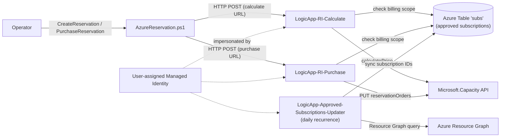

# Automatically Purchase Reserved Instances in Azure

Automate the purchase of Azure Reserved Instances (RIs) through a simple PowerShell client, with a built-in governance guardrail that restricts purchases to an approved allow-list of subscriptions (billing scopes).

- **Client side:** a single PowerShell script ([`AzureReservation.ps1`](AzureReservation.ps1)) that calls HTTP-triggered Logic Apps to calculate and purchase reservations.
- **Server side:** an ARM template ([`armTemplate.json`](armTemplate.json)) that deploys a managed identity, a storage account, and three Logic Apps that enforce the guardrail and call the Azure Capacity APIs.

---

## 1. Architecture



The three Logic Apps share a single **user-assigned managed identity**. The `subs` table acts as an allow-list: a reservation can only be calculated or purchased if its billing scope (subscription ID) exists in the table. The updater Logic App keeps that list in sync with all subscriptions under a chosen Management Group.

---

## 2. Components

### 2.1 Server side

Deployed by [`armTemplate.json`](armTemplate.json): one managed identity, one storage account, one API connection, a table-creation deployment script, and three Logic Apps.

#### 2.1.1 Managed Identity

A user-assigned managed identity (MI) is used across the utility to access Azure. It requires:

| Role | Scope | Assigned by |
| --- | --- | --- |
| `Storage Table Data Contributor` | The deployed storage account | ARM template (automatic) |
| `Reader` | Tenant Root Group | **Manual** (see [Post-deployment setup](#5-post-deployment-setup)) |
| `Reservations Contributor` | Reservations | **Manual** (see [Post-deployment setup](#5-post-deployment-setup)) |

All three Logic Apps are configured to run **as this MI**, so they inherit its access. The template wires the MI into every Logic App automatically — no manual authentication wiring is required.

#### 2.1.2 Storage Account

A StorageV2 account is used for **Azure Tables only**. The `subs` table holds the list of approved subscription IDs that may be used as a billing scope. The table has no schema beyond the keys — each approved subscription is stored with both its `PartitionKey` and `RowKey` set to the subscription ID. The template creates the table automatically via a deployment script.

#### 2.1.3 Logic Apps

- **`LogicApp-Approved-Subscriptions-Updater`** — Runs on a daily recurrence (hour, time zone, and interval are configurable). It queries Azure Resource Graph for every subscription under the configured Management Group, then replaces the contents of the `subs` table with that list.
- **`LogicApp-RI-Calculate`** — HTTP-triggered. Validates the requested billing scope against the `subs` table, then calls `Microsoft.Capacity/calculatePrice`. Returns the price and the `reservationOrderId`. If the scope is not approved, it returns `Not allowed to buy reservation under this billing scope.`
- **`LogicApp-RI-Purchase`** — HTTP-triggered. Performs the same guardrail check, then issues `PUT Microsoft.Capacity/reservationOrders` to finalize the purchase.

> The stand-alone files [`LogicApp-RI-Calculate.json`](LogicApp-RI-Calculate.json), [`LogicApp-RI-Purchase.json`](LogicApp-RI-Purchase.json), and [`LogicApp-Approved-Subscriptions-Updater.json`](LogicApp-Approved-Subscriptions-Updater.json) are reference exports of the workflow definitions. The authoritative, parameterized versions are embedded in [`armTemplate.json`](armTemplate.json).

### 2.2 Client side

[`AzureReservation.ps1`](AzureReservation.ps1) makes the HTTP calls to the calculate/purchase Logic Apps. It supports two operations: `CreateReservation` and `PurchaseReservation`.

---

## 3. Prerequisites

- An Azure subscription and resource group to deploy into.
- Permission to create **role assignments** at the tenant root and on the storage account (typically `Owner` or `User Access Administrator` on the relevant scopes).
- Rights to grant the MI `Reader` on the **Tenant Root Group** and `Reservations Contributor` on **Reservations**.
- Windows PowerShell 5.1 or later (PowerShell 7+ also works).
- A target **Management Group** whose child subscriptions define the approved billing scopes.

---

## 4. Deployment

Deploy the ARM template with the button below, then complete the [post-deployment setup](#5-post-deployment-setup).

<a href="https://portal.azure.com/#create/Microsoft.Template/uri/https%3A%2F%2Fraw.githubusercontent.com%2Fzmustafa%2FAutoPurchaseReservedInstance%2Frefs%2Fheads%2Fmain%2FarmTemplate.json" target="_blank"></a>

### ARM template parameters

| Parameter | Required | Default | Description |
| --- | --- | --- | --- |
| `managementGroupName` | **Yes** | _(none)_ | Management Group whose child subscriptions are synced into the approved allow-list. |
| `location` | No | Resource group location | Azure region for all resources. |
| `storageAccountName` | No | `st<uniqueString>` | Name of the storage account. |
| `tableName` | No | `subs` | Name of the Azure Table holding approved subscriptions. |
| `identityName` | No | `ManagedIdentity-RIPurchasherAccess` | Name of the user-assigned managed identity. |
| `laApprovedSubsUpdaterName` | No | `LogicApp-Approved-Subscriptions-Updater` | Name of the updater Logic App. |
| `laRICalculateName` | No | `LogicApp-RI-Calculate` | Name of the calculate Logic App. |
| `laRIPurchaseName` | No | `LogicApp-RI-Purchase` | Name of the purchase Logic App. |
| `recurrenceHour` | No | `6` | Hour (0–23) the updater runs. |
| `recurrenceTimeZone` | No | `Eastern Standard Time` | Time zone for the updater schedule. |
| `recurrenceIntervalDays` | No | `1` | Interval, in days, between updater runs. |

The template automatically creates the storage account, the `subs` table, the managed identity, the Azure Tables API connection, assigns `Storage Table Data Contributor` to the MI, and deploys all three Logic Apps configured to run as the MI.

---

## 5. Post-deployment setup

Two role assignments cannot be created by the template and must be granted manually to the deployed managed identity:

1. Grant the MI **`Reader`** over the **Tenant Root Group** (required so the updater can enumerate subscriptions).
2. Grant the MI **`Reservations Contributor`** under the **Reservations** blade (required to create and purchase reservations).

Then, retrieve the HTTP trigger URLs you'll pass to the PowerShell client:

- Open **`LogicApp-RI-Calculate`** → the `When a HTTP request is received` trigger → copy the **callback URL**. Use this for `CreateReservation`.
- Open **`LogicApp-RI-Purchase`** → the same trigger → copy its **callback URL**. Use this for `PurchaseReservation`.

> The two Logic Apps have **different** URLs. Be sure to use the calculate URL for `CreateReservation` and the purchase URL for `PurchaseReservation`.

---

## 6. Usage

### 6.1 Create a reservation order (calculate)

Calls `LogicApp-RI-Calculate` and returns a reservation order ID.

```powershell
.\AzureReservation.ps1 -Operation CreateReservation `
  -SkuName "Standard_B1s" `
  -Location "eastus" `
  -Term "P1Y" `
  -Quantity 1 `
  -BillingScopeId "xxxxxxxx-xxxx-xxxx-xxxx-xxxxxxxxxxxx" `
  -AppliedScopeType "Shared" `
  -AppliedScopes "/subscriptions/xxxxxxxx-xxxx-xxxx-xxxx-xxxxxxxxxxxx" `
  -logicAppUrl "https://<calculate-logic-app-callback-url>" `
  -Verbose
```

Take note of the returned order ID:

```text
Reservation Order ID: xxxxxxxx-xxxx-xxxx-xxxx-xxxxxxxxxxxx
```

### 6.2 Purchase the reservation order

Calls `LogicApp-RI-Purchase` using the order ID from the previous step.

```powershell
.\AzureReservation.ps1 -Operation PurchaseReservation `
  -ReservationOrderId "xxxxxxxx-xxxx-xxxx-xxxx-xxxxxxxxxxxx" `
  -SkuName "Standard_B1s" `
  -Location "eastus" `
  -Term "P1Y" `
  -Quantity 1 `
  -BillingScopeId "xxxxxxxx-xxxx-xxxx-xxxx-xxxxxxxxxxxx" `
  -AppliedScopeType "Shared" `
  -AppliedScopes "/subscriptions/xxxxxxxx-xxxx-xxxx-xxxx-xxxxxxxxxxxx" `
  -logicAppUrl "https://<purchase-logic-app-callback-url>" `
  -Verbose
```

Confirm the purchase when prompted:

```text
Are you sure you want to purchase the reservation? (Y/N) y
```

### 6.3 Parameter reference

| Parameter | Required | Default | Notes |
| --- | --- | --- | --- |
| `Operation` | **Yes** | — | `CreateReservation` or `PurchaseReservation`. |
| `Location` | **Yes** | — | Azure region (validated against a fixed list). |
| `BillingScopeId` | **Yes** | — | Subscription ID used as the billing scope; must be in the approved `subs` table. |
| `Term` | **Yes** | `P1Y` | `P1Y`, `P3Y`, or `P5Y`. |
| `Quantity` | **Yes** | `1` | Number of reserved instances. |
| `logicAppUrl` | **Yes** | — | Callback URL of the relevant Logic App (calculate vs purchase). |
| `SkuName` | No | `Standard_B1s` | VM SKU to reserve. |
| `AppliedScopeType` | No | `Single` | `Single` or `Shared`. When `Shared` on create, `AppliedScopes` is sent as null. |
| `AppliedScopes` | No | `/subscriptions/<GUID>` | Applied scope path; ignored when `AppliedScopeType` is `Shared`. |
| `ReservedResourceType` | No | `VirtualMachines` | Type of reserved resource. |
| `DisplayName` | No | `VM_RI_<timestamp>` | Reservation display name. |
| `InstanceFlexibility` | No | `On` | Instance flexibility setting. |
| `Renew` | No | `$true` | Enable auto-renewal. |
| `BillingPlan` | No | `Upfront` | `Upfront` or `Monthly`. |
| `ReservationOrderId` | Conditional | — | Required for `PurchaseReservation`. |

---

## 7. How the guardrail works

Both the calculate and purchase Logic Apps look up the requested `BillingScopeId` in the `subs` table before doing anything. If the subscription is not present, the request is rejected with:

```text
Not allowed to buy reservation under this billing scope.
```

The `subs` table is populated automatically by `LogicApp-Approved-Subscriptions-Updater`, which runs on the configured schedule and mirrors all subscriptions under the chosen Management Group. To change which subscriptions are eligible, adjust the `managementGroupName` (or the Management Group's membership) rather than editing the table by hand.

---

## 8. Notes & troubleshooting

- **Wrong URL used:** using the purchase URL for `CreateReservation` (or vice versa) will produce unexpected results. Double-check §5.
- **`Not allowed to buy reservation...`:** the billing scope isn't in the `subs` table yet. Confirm the subscription is under the configured Management Group and that the updater has run.
- **Permission errors from the Logic Apps:** verify the MI has `Reader` on the Tenant Root Group and `Reservations Contributor` on Reservations.
- **Currency/pricing:** the calculate response includes `billingCurrencyTotal`, `netTotal`, `taxTotal`, and `grandTotal` from the Azure Capacity API.

---

## 9. License

See [LICENSE](LICENSE).

 
